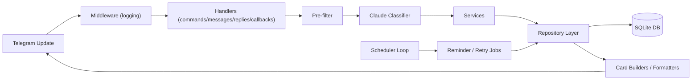

# Customs Tracker Bot

Telegram bot for tracking custom content orders in a forum-topic workflow.

The bot watches one configured Telegram topic, detects new briefs, creates task cards, manages lifecycle state changes through inline buttons, and sends a daily morning digest. It uses Claude (Anthropic) for brief classification and SQLite (via SQLAlchemy + Alembic) for persistence.

## What This Project Does

- Auto-detects potential briefs from topic messages (heuristic pre-filter + AI classifier).
- Creates structured task records and interactive Telegram cards.
- Supports manual task creation with `/add` when AI misses a brief.
- Tracks full task lifecycle:
  - `draft -> awaiting_confirmation -> processing -> finished -> delivered`
  - terminal states: `delivered`, `cancelled`
- Manages role-based access (`admin`, `model`, `teamlead`) from DB-backed memberships.
- Runs background jobs for daily morning digest (with overdue/due-today/finished-not-delivered details) and AI retry processing.
- Provides operational commands for setup, health checks, settings, stats, task browsing, and role management.

## Architecture Overview



## Tech Stack

- Python 3.12+
- [aiogram 3](https://docs.aiogram.dev/) (Telegram bot framework)
- SQLAlchemy async + `aiosqlite`
- Alembic (schema migrations)
- Anthropic SDK (Claude classification)
- `pydantic-settings` for `.env` loading
- `structlog` for structured logging
- `pytest` + `pytest-asyncio` for tests
- FastAPI + Jinja2 + HTMX (optional web dashboard)
- Tailwind CSS + DaisyUI (CDN)
- `itsdangerous` (signed session cookies)

## Repository Structure

- `bot.py`: application entrypoint, startup wiring, router registration, scheduler task lifecycle.
- `core/`: config singletons, constants, permissions, common helpers, exceptions.
- `ai/`: classifier integration and prompt template.
- `db/`: SQLAlchemy models, engine/session, repository layer.
- `handlers/`: Telegram command/message/reply/callback handlers.
- `services/`: business logic (brief pipeline, role loading, settings loading, task data prep, postpone flow).
- `scheduler/`: periodic job loop and individual job modules.
- `ui/`: card text + inline keyboard builders and formatting utilities.
- `diagnostics/`: readiness checks and startup error builder.
- `alembic/`: migration environment and schema revisions.
- `web/`: optional web dashboard (FastAPI app, templates, routes, auth, static assets).
- `tests/`: targeted behavior tests for readiness gates, reply keyword detection, postpone cleanup, and settings behavior.

## Data Model

All DB tables are created through Alembic (`0001_initial_db_first`, `0002_add_ai_retry_queue`).

### `tasks`
Core task entity with:
- Telegram binding: `chat_id`, `topic_id`, `message_id`, `bot_message_id`
- Parsed fields: buyer link/name, amounts, description, outfit, notes, priority, deadline, platform
- Status and timestamps: `status`, `finished_at`, `delivered_at`, `last_reminder_at`
- Metadata: `raw_text`, `ai_confidence`, `created_at`, `updated_at`

Key indexes:
- unique `(chat_id, message_id)` for idempotency
- status index
- deadline index

### `status_logs`
Audit trail of status changes and metadata edits (deadline/priority changes are logged as same-status events with `note`).

### `processed_messages`
Idempotency table: marks message as processed, with `is_task` flag.

### `parse_failures`
Stores failed parse/classification attempts and error details.

### `ai_retry_queue`
Queue for transient AI failures with retry scheduling/backoff metadata.

### `role_memberships`
Role assignments for `admin`, `model`, `teamlead`, supporting ID and/or username identity.

### `app_settings` (singleton row `id=1`)
Runtime-configurable settings:
- working chat/topic IDs
- AI model + confidence threshold
- finished reminder hours (threshold for "finished but not delivered" in digest)
- timezone (stored but runtime currently forced to `Europe/Moscow`)

## Task Lifecycle

Allowed transitions (`core/constants.py`):

- `draft -> awaiting_confirmation | cancelled`
- `awaiting_confirmation -> processing | cancelled`
- `processing -> finished | cancelled`
- `finished -> delivered`
- `delivered` and `cancelled` are terminal

The bot enforces transitions in repository logic (`task_repo.update_task_status`) and writes a `status_logs` record for every status update.

## Roles and Permissions

Role checks are cached in memory from DB at startup and refreshed on updates.

- `admin`: full management (setup after bootstrap, settings, stats, role admin, revert, delivery confirmation, etc.)
- `model`: can take/finish tasks, add briefs manually, postpone deadlines
- `teamlead`: can confirm briefs/delivery flows, postpone deadlines, add briefs manually

Special behavior:
- If a role is stored by username only and the user later interacts, the bot resolves and persists user ID automatically.

## Setup and Run

### 1. Install dependencies

```bash
uv sync
```

### 2. Configure environment

Copy `.env.example` to `.env` and set:

- `BOT_TOKEN` (required)
- `ANTHROPIC_API_KEY` (required)
- `DB_PATH` (default `data/customs.db`)
- `LOG_LEVEL` (default `INFO`)

### 3. Start bot

```bash
uv run python bot.py
```

On startup, the bot:
- validates config readiness
- runs Alembic migrations to head
- ensures `app_settings` singleton exists
- loads runtime settings and role cache
- starts polling + scheduler

### 4. First-time bootstrap in Telegram

1. Add bot to a forum-enabled group.
2. Open the target topic.
3. Send `/setup` inside that topic.

`/setup`:
- stores working `chat_id` + `topic_id` in DB
- bootstraps first admin automatically if admin list is empty
- shows next-step helper buttons for adding model/teamlead and health check

## Runtime Settings (`/settings`)

Runtime settings are stored in DB (`app_settings`) and loaded into `core.config.runtime`.

Supported keys:
- `confidence`
- `finished_reminder_hours`
- `reset` (restore defaults)

Notes:
- `/settings` works only for admins in the configured working topic.
- `timezone` changes are intentionally disabled in command flow; runtime timezone is forced to `Europe/Moscow` in `services/settings_service.py`.

## Command Reference

### General

- `/help`: command help, adjusted by role
- `/id`: show current chat/topic IDs
- `/status`: active summary with quick open buttons
- `/list [filter]`: task list (`all`, `active`, `overdue`, `draft`, `awaiting`, `processing`, `finished`, `delivered`)
- `/task <id>`: full task detail with status card controls

### Brief Ingestion

- Automatic: any non-command, non-reply message in working topic passes through pre-filter + AI pipeline.
- Manual: `/add` as reply to a message (admin/model/teamlead).

### Admin/Operations

- `/setup`: bind working topic and bootstrap first admin
- `/health`: readiness diagnostics (blockers + warnings)
- `/settings ...`: runtime settings management
- `/stats [month]`: monthly metrics
- `/revert <id>`: force task back one lifecycle step
- `/admin ...`, `/model ...`, `/teamlead ...`: role CRUD
- `/roles`: role overview

## Callback Actions (Inline Buttons)

Task card callbacks use `task:{id}:{action}`.

Main actions:
- `confirm_brief`, `not_task`
- `take`, `finish`, `delivered`
- `postpone`, `postpone_1d`, `postpone_3d`, `postpone_7d`, `cancel_postpone`
- `open`
- confirmation dialog actions for reply-detected events:
  - `confirm_shot`, `deny_shot`
  - `confirm_delivered`, `deny_delivered`

Safety details:
- "Not task" delete requires second confirmation within 10 seconds.
- Postpone interaction stores pending per-user state with 120-second TTL.

## Message Processing Pipeline

### Normal topic messages (`handlers/messages.py`)

1. Skip commands.
2. Skip true replies (except topic-root pseudo-replies).
3. Handle pending postpone date input if active.
4. Skip already processed messages.
5. Run `process_brief` pipeline.

### `process_brief` pipeline (`services/brief_pipeline.py`)

1. Readiness gate (`evaluate_brief_env_readiness`).
2. Pre-filter heuristic (`pre_filter.py`):
  - direct markers, emojis, keywords, platform links, payment markers, text length score
  - teamlead messages bypass heuristic
3. AI classification (`ai/classifier.py`).
4. Confidence gate (`runtime.ai_confidence_threshold`).
5. Task creation with idempotency and race recovery.
6. Send draft card and store `bot_message_id`.
7. Mark source message as processed.

### Edited messages

If linked task exists, message is reclassified and task fields are updated from fresh AI parse; card is re-rendered.

### Reply handler (`handlers/replies.py`)

- Detects shot/delivery keywords in replies linked to tasks.
- Sends confirmation prompt callbacks to avoid accidental status flips.
- Supports deadline change by replying with date to bot card (`DD.MM` or `DD.MM.YYYY`).
- Falls back to brief pipeline for replies not linked to tasks and not yet processed.

## AI Classifier and Reliability

Classifier:
- model from runtime settings (`runtime.ai_model`)
- system prompt in `ai/prompts.py`
- strict JSON normalization and schema checks
- AI text policy: `description`, `outfit`, `notes`, and non-task `reason` are generated in Russian

Inline retries:
- max inline retries: `AI_MAX_INLINE_RETRIES = 2`
- exponential delay base: `2s`
- timeout: `30s`

If transient failures continue:
- message is enqueued in `ai_retry_queue`
- retry processor job handles backoff and eventual failure handling

Retry queue policy:
- backoff minutes: `[2, 5, 10, 20, 40]`
- max attempts: `5`
- max retry window: `2 hours`
- exhausted items are logged to `parse_failures`, marked processed, and alert is sent to working chat/topic.

## Historical Russian Text Backfill

Use the one-off CLI script to reclassify existing tasks and update text fields:
- `description`
- `outfit`
- `notes`

Dry-run (default):

```bash
uv run python /Users/dmitriy/code/customs-tracker-bot/scripts/backfill_russian_text_fields.py
```

Apply changes:

```bash
uv run python /Users/dmitriy/code/customs-tracker-bot/scripts/backfill_russian_text_fields.py --apply
```

Optional filters:
- `--task-id <id>`: process one task
- `--limit <N>`: process only first N tasks by id

Behavior:
- best-effort: failures are reported per task and processing continues
- exit code is non-zero if any task failed
- non-task `reason` is not backfilled historically because it is not stored in the `tasks` table

## Scheduler Jobs

Scheduler loop runs every minute and triggers jobs by interval:

- Retry queue scan: every 1 minute
- Morning digest: once per day at local hour `9` (includes overdue tasks, due-today tasks, finished-not-delivered tasks, and summary stats)

## Health/Readiness Checks

`diagnostics/readiness.py` provides:
- blockers (missing bot token/API key/chat/topic/model/invalid timezone)
- warnings (invalid ranges for confidence/finished_reminder_hours settings)

Startup behavior:
- fatal blockers: missing/invalid bot token, missing Anthropic key -> startup exits with `StartupConfigError`
- non-fatal blockers: bot still starts, but brief processing can be blocked

## Logging and Observability

- Structured logs via `structlog`.
- Global update middleware logs incoming update context (message IDs, chat/topic, user, previews).
- Pipeline logs include pre-filter decisions, AI outcomes, task creation, and scheduler events.

## Testing

Run tests:

```bash
python3 -m pytest -q
```

Current tests cover:
- readiness gating in `/add` and `process_brief`
- health command message mapping behavior
- settings timezone lock and confidence update flow
- postpone prompt markup cleanup on timeout/success
- reply keyword detection for "shot" reports

## Web Dashboard

An optional read-only web dashboard for monitoring tasks, viewing stats, and browsing audit logs — without opening Telegram.

### Enabling the Web Dashboard

Add the following to your `.env`:

```
WEB_ENABLED=true
WEB_SECRET_KEY=your-random-secret-string
WEB_ADMIN_CODE=admin-code-word
WEB_MODEL_CODE=model-code-word
WEB_TEAMLEAD_CODE=teamlead-code-word
```

The web server starts alongside the bot as an asyncio task when `WEB_ENABLED=true` and `WEB_SECRET_KEY` is set. By default it listens on `127.0.0.1:8080`.

### Authentication

Each role has a shared code-word. Users enter the code-word on the login page to get a signed session cookie. No usernames or passwords.

| Env var | Description |
|---|---|
| `WEB_SECRET_KEY` | Secret for signing session cookies (required) |
| `WEB_ADMIN_CODE` | Code-word for admin access |
| `WEB_MODEL_CODE` | Code-word for model access |
| `WEB_TEAMLEAD_CODE` | Code-word for teamlead access |
| `WEB_HOST` | Bind address (default: `127.0.0.1`) |
| `WEB_PORT` | Port (default: `8080`) |
| `WEB_COOKIE_TTL_DAYS` | Session cookie lifetime in days (default: `7`) |
| `WEB_COOKIE_SECURE` | Set `true` if behind HTTPS reverse proxy (default: `false`) |

### Pages

- **Dashboard** (`/`) — stat counters, overdue tasks, upcoming deadlines, recent updates
- **Task List** (`/tasks`) — filterable card grid with status tabs (HTMX partial updates)
- **Task Detail** (`/tasks/{id}`) — full task info + audit log timeline (admin/teamlead only see audit log)
- **Stats** (`/stats`) — monthly analytics with platform breakdown (admin/teamlead only)

### Tech Stack

- FastAPI + Jinja2 (server-rendered)
- HTMX for partial page updates
- Tailwind CSS + DaisyUI (CDN) for styling
- Same SQLite database as the bot (shared process, no cross-process issues)

### External Access

For access outside localhost, set up a reverse proxy (nginx/caddy) and set `WEB_COOKIE_SECURE=true`.

## Development Notes and Constraints

- Dates are persisted mostly as strings (ISO-like), not native datetime columns.
- Timezone is currently hard-fixed at runtime to `Europe/Moscow` even if DB stores another value.
- Bot is polling-based (`Dispatcher.start_polling`), not webhook-based.
- Repositories never commit; transaction boundaries are in handlers/services.
- `db/repo/__init__.py` and several package `__init__.py` files are intentionally empty.

## Useful Entry Files for Further Work

- `bot.py`
- `services/brief_pipeline.py`
- `handlers/messages.py`
- `handlers/replies.py`
- `handlers/callbacks.py`
- `db/models.py`
- `scheduler/runner.py`
